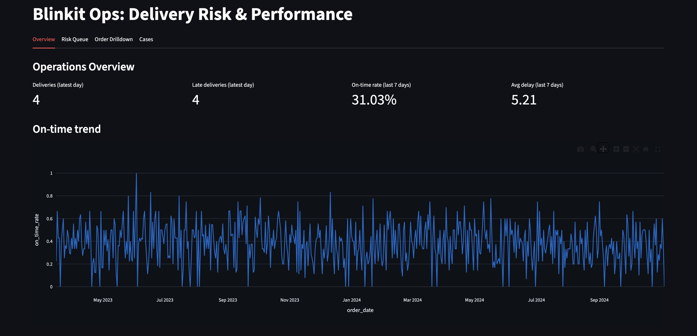
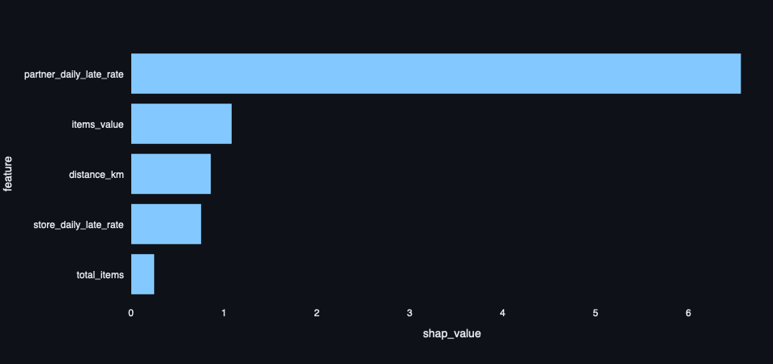

# Blinkit Ops – Delivery Risk & Operations Intelligence

## Live Demo:
https://blinkit-ops.onrender.com

Note: Free hosting may sleep when inactive. First load can take ~10–20 seconds.

Blinkit Ops is an end-to-end operations analytics platform that helps identify, explain, and act on delivery delays.
It combines SQL-based analytics, machine learning risk scoring, SHAP explainability, and an interactive operations dashboard.

This project is designed to mirror how real internal ops tools are built and used by data teams.

# What this solves

### Delivery operations teams need to answer three questions quickly:

1. What’s going wrong right now?
2. Why is it happening?
3. What action should we take?

## This project addresses all three:

* Real-time performance KPIs
* Risk-ranked deliveries
* Model explanations for delays
* Intervention case management

## Key Features
### Operations KPIs
  * Daily on-time rate
  * Late delivery trends
  * Store-level and partner-level performance
  * Delay reason distribution

### Delivery Risk Scoring
  * ML model predicts likelihood of late delivery
  * Orders ranked by risk score
  * Supports proactive intervention

### SHAP Explainability
  * Global feature importance
  * Per-order explanations
  * Clear visibility into what drives delay risk

### Case Management
  * Create intervention cases for risky orders
  * Assign priority and ownership
  * Update status (Open → In Progress → Resolved)
  * Dashboard updates instantly

# Dashboard Screenshots

